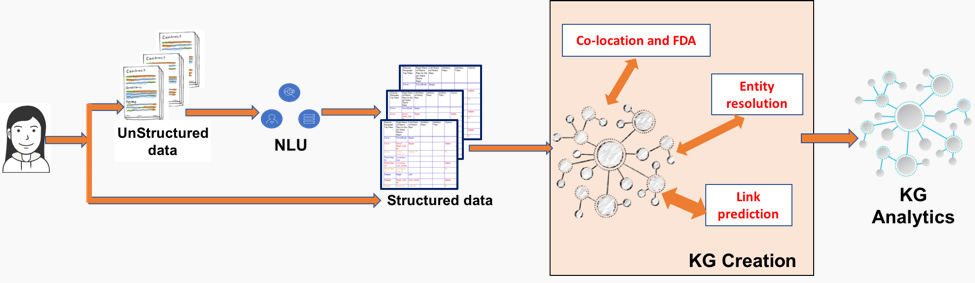

---

copyright:
  years: 2015, 2018
lastupdated: "2018-01-31"

---

{:shortdesc: .shortdesc}
{:new_window: target="_blank"}
{:tip: .tip}
{:pre: .pre}
{:codeblock: .codeblock}
{:screen: .screen}
{:javascript: .ph data-hd-programlang='javascript'}
{:java: .ph data-hd-programlang='java'}
{:python: .ph data-hd-programlang='python'}
{:swift: .ph data-hd-programlang='swift'}

# Watson Discovery Knowledge Graph

Knowledge graphs go beyond just data and information by making connections within your data across documents and generating new knowledge. We provide the AI technology that automatically creates custom knowledge graphs from unstructured data by extracting and disambiguating entities and relationships, enriching the relationships using algorithmic techniques and ranking the results using relevance algorithms. Knowledge Graphs can function as the "knowledge hub" for your company and can be used for enterprise search, summarization, recommendation engines, other decision making processes - for example, detecting fraud, waste, or abuse. The use of a custom model (created in {{site.data.keyword.knowledgestudioshort}}) in the Knowledge Graph creation process, can help build domain specific KGs with applicability in domains such as financial, technology, security, intelligence, healthcare and many others.

Two new end-points have been added to {{site.data.keyword.discoveryfull}} – providing the ability to search for disambiguated entities and enriched relations across-documents in unstructured document collections. Search results can be rank ordered by relevance or popularity. In addition to a search token, the APIs can use optional context word(s) or passages that finds more relevant entities and relations within the large automatically created knowledge graph.

 The following figure shows how Knowledge Graph fits in the current {{site.data.keyword.discoveryfull}} pipeline. {{site.data.keyword.nlushort}} enriches documents with entities and documents at the individual document level. During Knowledge Graph creation, implicit (automatic) entity resolution and graph expansion techniques are used to automatically create a connected graph of entities and relations across documents. In addition to the Knowledge Graph being created, the Knowledge Graph analytics service adds relevance-ranking techniques to return results.



This connected graph of knowledge and ranking techniques provides:

-  Disambiguated entities by using a fuzzy search token, type information (optional) and context (optional). Example: Searching for `Steve` in context of `Apple` returns `Steve Jobs` on top while searching for `Steve` in context of `Microsoft` returns `Steve Ballmer` on top.
-  Relevance ranked relationships by inputting fuzzy search token and context (optional). Relevance-ranking utilizes the global properties of the graph to surface more specific information. Example: Searching for relationships of `Obama` in context of `health` returns `Affordable Care Act` and other related entities.
-  Inferences and aggregations across documents by querying for entities and relationships in a connected graph of knowledge. Some examples of such queries are: How is person X connected to person Y? How different are the data access patterns of employee X from the norm? What is the sphere of influence of person X?

## Service requirements

During the beta release, Knowledge Graph functionality and the methods associated with it are only available for service instances that are subscribed to the **Advanced** plan.

## Collection requirements

{{site.data.keyword.discoveryshort}} uses Entities and Relationships extracted from ingested documents to form the Knowledge Graph and allow entity and relationship queries.

**Note:** Knowledge Graph can be used on private data collections only, it is not designed for use with {{site.data.keyword.discoverynewsshort}}.

To use Knowledge Graph, your collection must be configured to meet specific requirements as follows:

-  Both the `entities` and `relations` enrichments must be specified for the fields which will utilize Knowledge Graph and each enrichment must use the same custom model. If the public model is required, it must be specified in the form of a custom model `model="en-news"`.

-  The `relations` enrichments must be specified as follows:
   ```json
   "relations": {
     "model": "en-news"
   }
   ```
   {: codeblock}

-  The `entities` enrichment must be specified as follows and must also have the `mentions`, `mentions_types`, and `sentence_locations` parameters specified:
   ```json
   "entities": {
     "mentions": true,
     "mention_types": true,
     "sentence_locations": true,
     "model": "en-news"
    }
    ```
    {: codeblock}

   Other optional `enrichments` options such as `"sentiment": true` can also be specified if desired.

These options cannot be added using the {{site.data.keyword.discoveryshort}} tooling, a custom configuration must be uploaded using the API. A copy of the default configuration modified to enrich the `text` field so that the collection can be used with knowledge graph with the public model is available [here](https://raw.githubusercontent.com/watson-developer-cloud/doc-tutorial-downloads/master/discovery/config-default-kg.json).

Create a custom configuration as follows, after creating a {{site.data.keyword.discoveryshort}} service instance:

1. Issue the following command to create an environment that is called `my-first-environment`. Replace `{username}` and `{password}` with your service credentials:

   ```bash
   curl -X POST -u "{username}":"{password}" -H "Content-Type: application/json" -d '{ "name":"my-first-environment", "description":"exploring environments"}' "api/v1/environments?version=2017-11-07"
   ```
   {: pre}

   The API returns information such as your environment ID, environment status, and how much storage your environment is using.

   You will need the `{environment_id}` that is returned; make sure to save that ID for later use.

1. Next, create the custom configuration. This procedure assumes that you are uploading the one found [here](https://raw.githubusercontent.com/watson-developer-cloud/doc-tutorial-downloads/master/discovery/config-default-kg.json). If you want to build your own custom configuration, see the [configuration reference](/docs/services/discovery/custom-config.html).

   ```bash
   curl -X POST -u "{username}":"{password}" -H "Content-Type: application/json" -d @config-default-kg.json "https://gateway.watsonplatform.net/discovery/api/v1/environments/{environment_id}/configurations?version=2017-11-07"
   ```
   {: pre}

   **If you already have a custom configuration, and would like to update it and use it**, use the {configuration ID} of your custom configuration in this command.

   ```bash
   curl -X PUT -u "{username}":"{password}" -H "Content-Type: application/json" -d @config-default-kg.json "https://gateway.watsonplatform.net/discovery/api/v1/environments/{environment_id}/configurations/{configuration ID}?version=2017-11-07"
   ```
   {: pre}

1. After the custom configuration has been uploaded it can be used in any collection that you create, any method to upload documents can be used as long as the custom configuration is specified. If you are unfamiliar with creating collections and uploading documents, see [Getting started with the tooling](/docs/services/discovery/getting-started-tool.html). When you get to [step 3](/docs/services/discovery/getting-started-tool.html#create-custom-configuration) select `Knowledge Graph Configuration` instead of creating a new configuration.

## Entities queries
{: #entities}

In the beta release of the Knowledge Graph entity queries supports context-based entity disambiguation. Based on the entity text provided and optional context text, disambiguation identifies unique entities and returns a list of the entities ranked based on the context information. A Knowledge Graph entity query is performed by `POST`ing a `JSON` object to the `v1/environments/{environment_id}/collections/{collection_id}/query_entities` endpoint.

You can query entities using the API, or with the {{site.data.keyword.discoveryshort}} tooling. See [Querying Knowledge Graph using the Discovery tooling](/docs/services/discovery/building-kg.html#querying-kg) for tooling information.

The Knowledge Graph entity query JSON object takes the following form:

```json
{
  "feature": "disambiguate",
  "entity": {
    "text": "Steve",
    "type": "Person"
  },
  "context": {
    "text": "iphone"
  },
  "count": 10
}
```
{: codeblock}

-  `"feature": string` _required_ - the entity query feature to be used, must be `disambiguate`.
-  `"entity": {}` _required_ - an object that contains the entity information to disambiguate.
   -  `"text": string` _required_ - the entity text that will be disambiguated
   -  `"type": string` _optional_ - the optional entity type to disambiguate against, if not specified, all types are included.
-  `"context": {}` _optional_ - an optional object that includes contextual requirements for the disambiguation.
   -  `"text": string` _optional_ - entity text to provide context for the queried entity and rank based on that association. For example, if you wanted to query the city of London in England your query would look for `London` with the context of `England`. Input can be partial names or large passages containing relevant entity terms. Multiple terms can be passed together.
-  `"count": INT` _optional_ - The number of disambiguated entities to return. The default is `10`. The maximum is `1000`

The query returns results of the following form:

```json
{
  "entities": [
    {
      "text": "Steve Jobs",
      "type": "PERSON"
    },
    {
      "text": "Steve Wozniak",
      "type": "PERSON"
    }
  ]
}
```
{: codeblock}  

If no match is found, the following JSON object is returned:

```json
{
  "entities": []
}
```
{: codeblock}

## Relations queries
{: #relations}

Knowledge Graph relations queries supports finding most relevant relationships based on input entities using implicit entity disambiguation, context based relationships, sorting by relevance score and mention count, and filtering by types and document ids.

You can query relations using the API, or with the {{site.data.keyword.discoveryshort}} tooling. See [Querying Knowledge Graph using the Discovery tooling](/docs/services/discovery/building-kg.html#querying-kg) for tooling information.

A Knowledge Graph entity query is performed by `POST`ing a `JSON` object to the  `v1/environments/{environment_id}/collections/{collection_id}/query_relations` endpoint. The Knowledge Graph relations query JSON object takes the following form:

```json
{
  "entities": [
    {
      "text": "Steve Jobs",
      "type": "PERSON",
      "exact": true
    }
  ],
  "context": {
    "text": "iphone"
  },
  "sort": "score",
  "filter": {
    "relation_types": {
      "exclude": ["colocation"],
      "include": ["locatedAt", "employedBy", "managerOf", "founderOf"]
    },
    "entity_types": {
      "exclude": ["EVENT"],
      "include": ["PERSON", "GPE", "ORGANIZATION"]
    },
    "document_ids": ["b95df4c1-d00f-4771-abb2-a52baea0444a", "ad340635-bf3e-47a5-bea5-5e778f600c32"]
  },
  "count": 10
}
```
{: codeblock}

-  `"entities": []` _required_ - an array that contains the entities that relationships will be queried. All neighbor relationships are returned if only one entity object is defined. When more than one entity object is defined, mutual pairwise relations are returned. Mutual pairwise relations return the direct relations between the input entities rather than the relations with all entity neighbors. Each entity object contains:
   -  `"text": string` _required_ - the entity text.
   -  `"type": string` _optional_ - the optional entity type. This field is required if `"exact"` is `true`.
   -  `"exact": boolean` _optional_ - If `false`, implicit disambiguation is performed. Implicit disambiguation will use the top one disambiguated entity for each input entity object. The default is `false`.
-  `"context": {}` _optional_ - an optional object that includes contextual requirements.
   -  `"text": string` _optional_ - Entity text to provide context for the queried entity and rank based on that association. For example, if you wanted to query the city of London in England your query would look for `London` with the context of `England`. Input can be partial names or large passages containing relevant entity terms. Multiple terms can be   passed together.
-  `"sort": string` _optional_ - the sorting method for the relationships, can be `score` or `frequency`. The default is `score`. `score` is based on relevance of relations and neighbors to the input entity and relevance to context if context is provided. `frequency` is the number of unique times each relation is identified.
-  `"filter": {}` _optional_ - an object containing the relation types, entity types, and specific documents to filter by for this query. By default nothing is excluded.
   -  `"relation_types": {}` _optional_ a list of relation types to filter.
      -  `"exclude": []` _optional_ a comma separated list of relation types to exclude from the query.
      -  `"include": []` _optional_ a comma separated list of relation types explicitly include in the query. If specified, all other types are considered excluded.
   -  `"entity_types": {}` _optional_ a list of entity types to filter neighbors. Not applicable for multi entities input because no new neighbor is returned.
      -  `"exclude": []` _optional_ a comma separated list of entity types to exclude from the query.
      -  `"include": []` _optional_ a comma separated list of entity types explicitly include in the query. If specified, all other types are considered excluded.
   -  `"document_ids": []` _optional_ a comma separated list of documents on which to perform the relationship query on.
-  `"count": INT` _optional_ The number of relations to return. The default is `10`. The maximum is `1000`.

The query returns results in the following form:

```json
{
  "relations": [
    {
      "type": "FOUNDEROF",
      "frequency": 7,
      "arguments": [
        {
          "entities": [
            {
              "type": "PERSON",
              "text": "Steve Jobs"
            }
          ]
        },
        {
          "entities": [
            {
              "type": "ORGANIZATION",
              "text": "Apple"
            }
          ]
        }
      ]
    }
  ]
}
```
{: codeblock}

In each object in the relationship array, an arguments array is returned containing a pair of entities arrays, the first being the source or subject and the second being the target or object of the relationship.

If no match is found, the following JSON object is returned:

```json
{
  "relations": []
}
```
{: codeblock}

## Querying Knowledge Graph using the Discovery tooling
{: #querying-kg}

Those with service instances subscribed to the [**Advanced**](/docs/services/discovery/building-kg.html#service-requirements) plan can query private collections with Knowledge Graph using the {{site.data.keyword.discoveryshort}} tooling.  

To access Knowledge Graph querying in the {{site.data.keyword.discoveryshort}} tooling:

1.  Click <!-- {width="20" height="20" style="padding-left:5px;padding-right:5px;"} --> to open the query page.
1.  Select your collection and click **Get started**.
1.  On the **Build queries** screen, choose the **Knowledge graph** tab, then **Entities** or **Relationships**.
